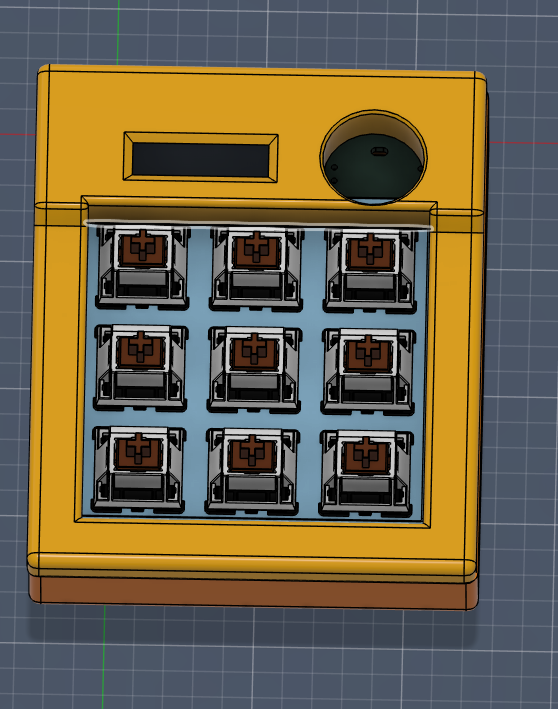

# PrateekPad – 9-Key OLED Macropad

PrateekPad is my custom 9-key macropad built completely from scratch.  
This was my first time designing a PCB, writing firmware for a microcontroller, and building a full 3D printed enclosure around it.

I started this project with zero experience in hardware design. Now it’s a fully working macropad with an OLED display, rotary encoder, custom PCB, and layered firmware system.

---

## Overview

PrateekPad is a compact productivity macropad powered by the **Seeed XIAO RP2040**.

Features include:

- 9 mechanical keys arranged in a **3×3 matrix**
- **Rotary encoder** with press functionality
- **128×32 I2C OLED display**
- **KMK firmware**
- **Layer switching system**
- **Custom 2-layer PCB**
- **Fully 3D-printed enclosure**

The goal of this project was to learn the complete workflow of designing a hardware product from scratch.

---

## Assembled Model

This shows the full assembled design including the case, switches, OLED display, and rotary encoder.

---

## Case Design

The enclosure was designed to be fully 3D printable with a removable switch plate and bottom panel.

---

## PCB Layout

A custom **2-layer PCB** was designed for the macropad using KiCad.  
It integrates the switch matrix, OLED connections, rotary encoder, and the Seeed XIAO RP2040.

---

## Schematic

The schematic shows the switch matrix, diode configuration, rotary encoder wiring, and OLED interface.

---

## Firmware

The firmware is written using **KMK**, which runs on the RP2040 microcontroller.

The macropad supports multiple layers that allow it to be used for:

- Coding shortcuts
- Media control
- Editing shortcuts
- Numpad input

The OLED display provides quick visual feedback about the current layer.

---

## Design Constraints

This project follows the Hackpad design rules:

- Through-hole **Seeed XIAO RP2040**
- **2-layer PCB**
- PCB under **100mm × 100mm**
- Case under **200mm × 200mm × 100mm**
- Fewer than **16 inputs**
- **Fully 3D printed enclosure**

---

## What I Learned

This project helped me learn many hardware design concepts including:

- Designing and routing a PCB
- Matrix scanning for keyboards
- Firmware development with KMK
- Mechanical design for 3D printing
- Creating production-ready manufacturing files

---

Built by **Prateek**.
