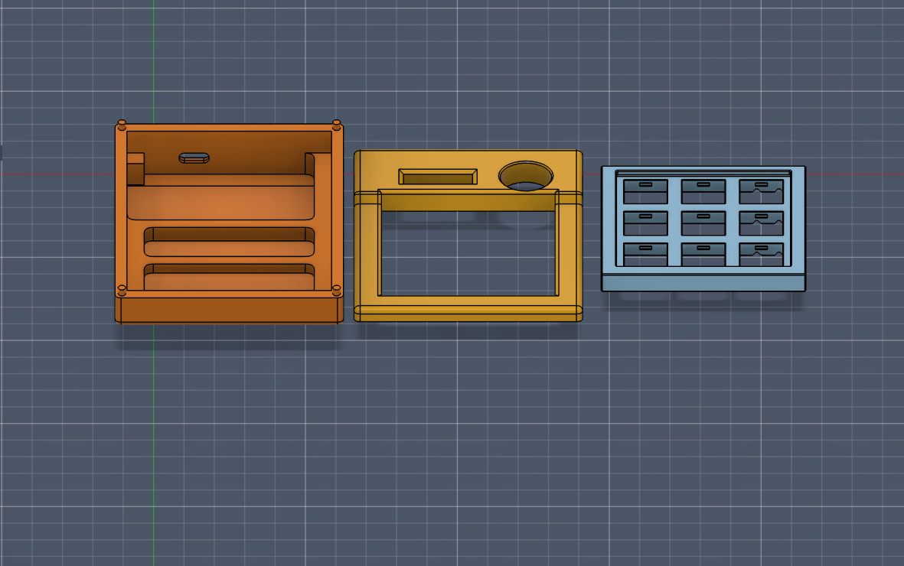
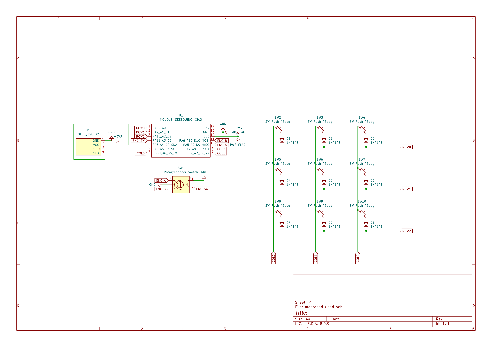
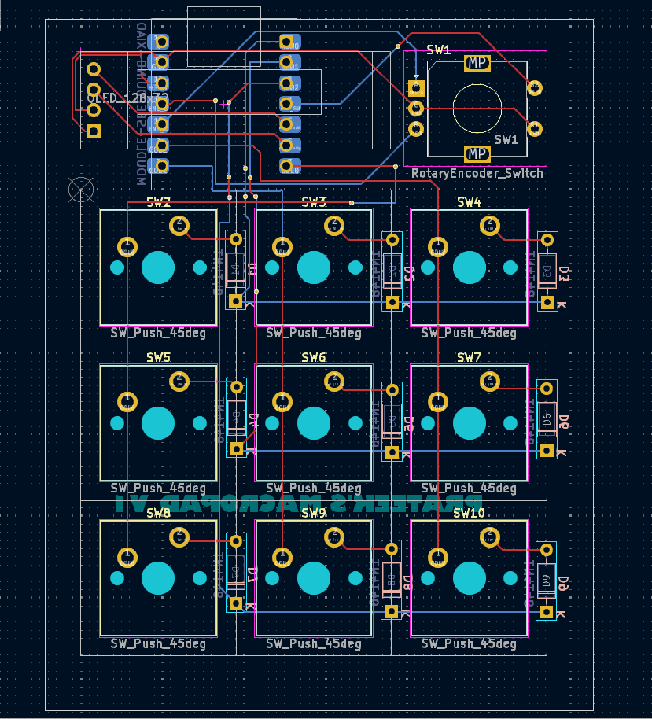

# PrateekPad

PrateekPad is my custom 9-key macropad built completely from scratch.  
This was my first time designing a PCB, writing firmware for a microcontroller, and building a full 3D printed enclosure around it.

I started this with zero experience in hardware design.  
Now it’s a fully working macropad with an OLED display, rotary encoder, and a layered firmware system.

---

## What It Is

A compact 9-key macropad powered by the Seeed XIAO RP2040.

It includes:

- 3x3 mechanical key matrix  
- Rotary encoder with press function  
- 128x32 I2C OLED display  
- Custom KMK firmware  
- Multi-layer switching system  
- Fully 3D printed case  
- 2-layer custom PCB  

This pad is designed to sit on my desk and improve my workflow while coding, editing, and consuming media.

---

## Why I Built It

I wanted to understand how hardware actually works beyond plugging modules together.

So instead of using prebuilt boards, I:

- Designed the schematic myself  
- Routed a 2-layer PCB  
- Created a removable switch plate design  
- Modeled the full enclosure  
- Wrote the firmware from scratch  

This project pushed me into learning real hardware design principles.

---

## How It Works

The firmware runs on KMK and uses a hold-based layer selection system.

By holding the mode key, I can switch between:

- Productivity / Coding Layer  
- Editing Layer  
- Media Control Layer  
- Numpad Layer  

The rotary encoder changes behavior depending on the active layer.

The OLED displays the current active layer for quick feedback.

---

## Design Snapshots

### Full Assembly

### Schematic

### PCB Layout

---

## Technical Constraints I Followed

- Through-hole Seeed XIAO RP2040
- 2-layer PCB
- PCB under 100mm
- Case under 200mm
- Under 16 total inputs
- Fully 3D printed parts only

---

## What I Learned

- How matrix scanning works
- PCB routing best practices
- Layer-based firmware logic
- Mechanical tolerances for 3D printing
- Exporting real production files
- How manufacturing files actually work

This project completely changed how I look at hardware design.

---

Built by Prateek.
